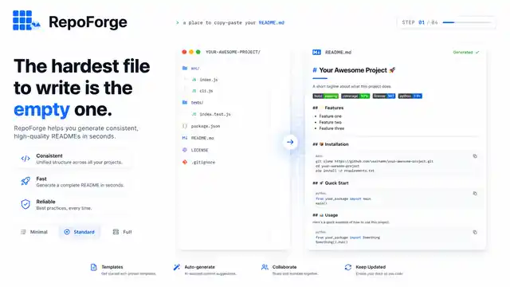

<p align="center">
  
</p>

<p align="center">
  
</p>

# GeoBoard

**A lightweight browser dashboard for exploring and sharing geospatial indicators.**

[](#run-locally) [](#deploy) [](#license)

Demo: https://demo.example.org

## Features

- Explore map-based indicators with filters and time controls.
- Share stable dashboard URLs with selected layers and views.
- Import GeoJSON datasets for lightweight team analysis.
- Run locally or deploy as a single container.

## Run Locally

Copy the example environment file, install dependencies, and start the development server.

```bash
cp .env.example .env
npm install
npm run dev
```

Open `http://localhost:3000` after the development server starts.

## Configuration

| Variable | Required | Purpose |
| --- | --- | --- |
| `DATABASE_URL` | Yes | PostgreSQL connection used by the application. |
| `APP_BASE_URL` | Yes | Public base URL used when generating shared links. |

## Deploy

The primary production path is the repository Docker image.

```bash
docker compose up -d
```

Persist the database volume and back it up before upgrades.

## License

MIT.
